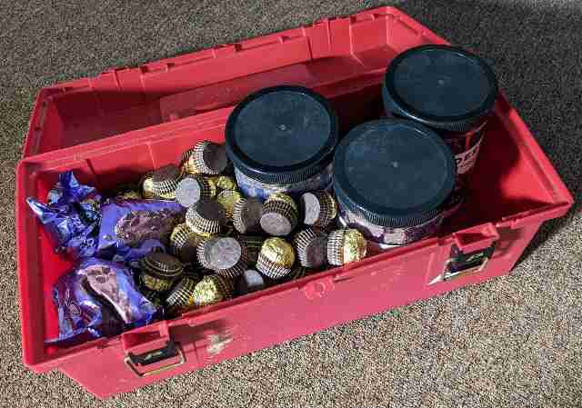
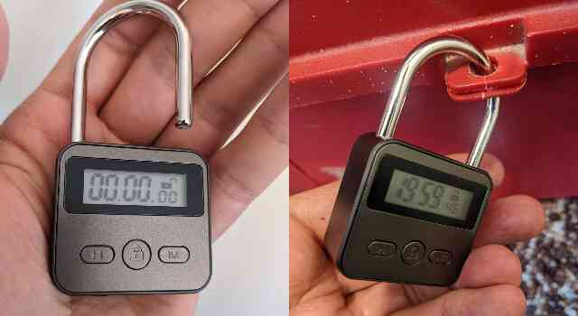

Commitment devices are tricks we can use to limit what choices we will have later. They can help us reach our goals when we think our willpower may fail. I wanted to share about a particular commitment device I use, because it works well for me and many people haven't heard of it.

I have no self restraint around eating chocolate. I usually eat any chocolate available to me until it is gone. I genuinely enjoy it. I am genuinely thankful to have it. And in earlier years of my life I suffered no consequences from eating it. But now too much chocolate badly affects my mood, and my weight too. I wanted a way to still eat chocolate, but to eat it responsibly. My willpower alone wasn't strong enough. So here's how this commitment device I discovered works.

_**Chocolate stash.** Ferrero Rocher, Sanders Milk Chocolate Sea Salt Caramels, and Ghirardelli 72% Cacao Dark Chocolate Premium Baking Chips are among my favorites._

You will need two things to get started.

- You will need a box. The box should be large enough to fit all your chocolate in. I like to find good bulk deals on chocolate, so I use a large repurposed toolbox - but any box with a hole you can slip the shackle of a lock through will do. 

- You will need a special kind of lock, called a _timer lock_. This lock has no key or combination to open it. Instead, it has a timer. You close the lock, set the timer, and push a button. When the timer reaches zero, the lock pops open. I use a [iayokocc product](https://www.amazon.com/Display-Multi-Function-Electronic-Rechargeable-Padlock/dp/B09D7RC5WX), but I'm sure other good options exist too.

Put all your chocolate in the box. Every morning, enjoy picking from the box a reasonable amount of your most delicious chocolate to last the day, whatever "reasonable" looks like for you. Then lock the box. This is your commitment. I keep the timer set for twenty hours for some wiggle room, and that way it opens reliably while I am still sleeping.

_**Timer lock.** The lock charges over USB, but retains its charge well. It has a straightforward UI, remembers its last timer setting, and the beeping sounds it makes when opening and closing can be muted._

If you are like me, the chocolate you took from the box will disappear well before lunch. You may notice that cravings happen in the afternoon, if you are home. You may feel upset that your chocolate is not accessible to you. Try to take some deep breaths. Remember that your past self was just watching out for you, and did this to help you. Remember that in the morning you will get to pick out more chocolate to eat, and then you help your future self of that day in the exact same way your past self is helping you!

At some point though you will need to restock your box. Restocking is a disruption to your routine, and a period of vulnerability: whatever chocolate you buy will be accessible to you until your lock pops open. You may consider timing your shopping trip in such a way as to minimize your access to the chocolate. I personally just accept the possibility that I may eat too much on restocking days. Another reason I buy in bulk, besides cost savings, is that I need to restock far less often.